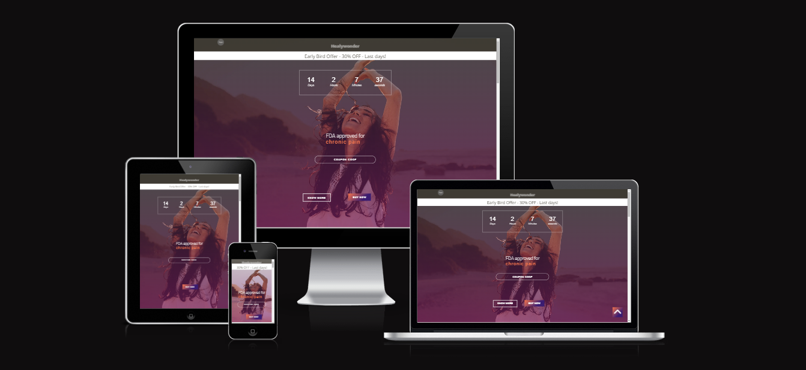
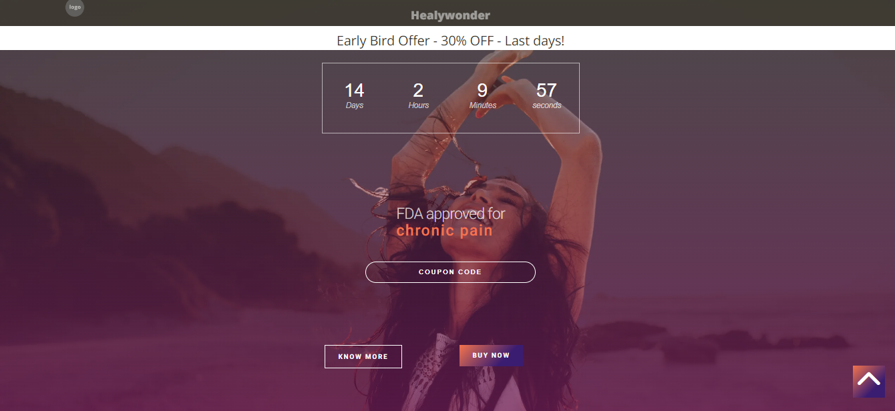
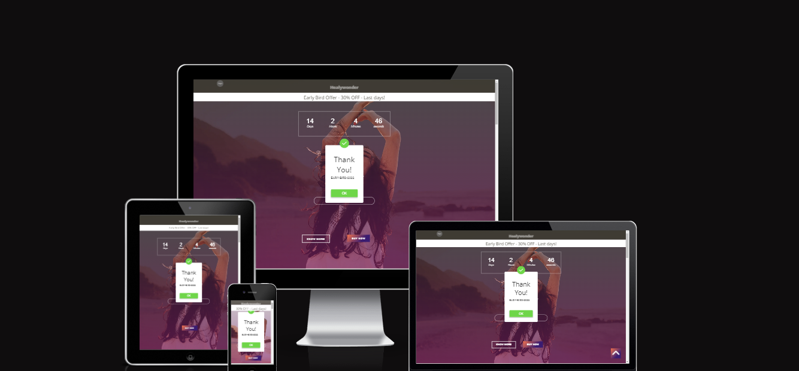
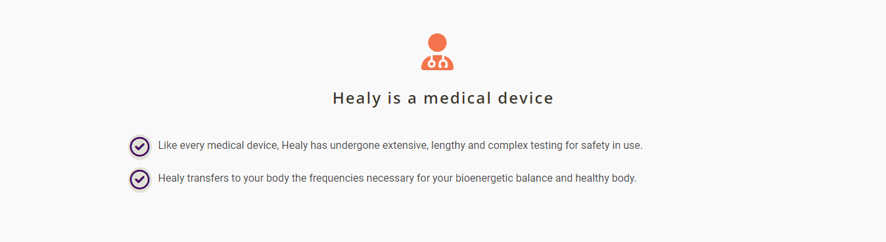
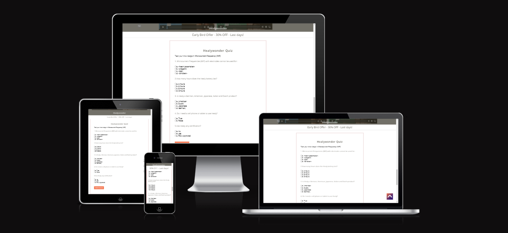
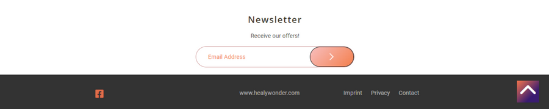
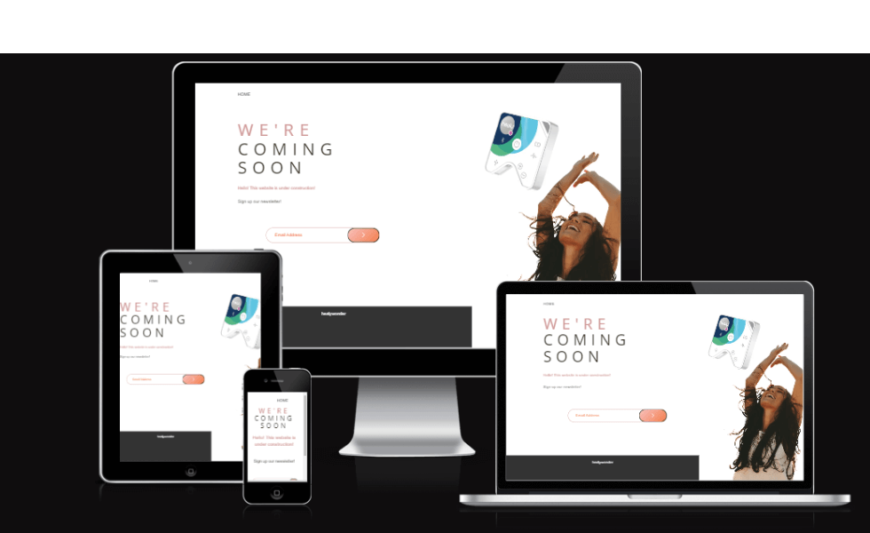

Welcome to [Healywonder](https://cintiamar.github.io/healywonder/index.html)


# Healywonder

## Design Concept
Healy Wonder is a ***Landing Page*** developed to promote sales offer for a frequency therapy in digital marketing campaigns to the ***female audience*** to a German device named **Healy**.

Healy is a device certified for chronic pain that uses microcurrent frequency (MIF) programs to increase your health, vitality, and well-being. 

The site's design concept communicates the feeling of well-being of a woman able to enjoy life without chronic pain.

Another important aspect is that While the homepage has dozens of possible distractions, the **landing page** is super **focused**.

### Buyer Persona

The design is developed to interact with the _female buyer persona_, ***classified in the limbic map as "Hedonist and Adventure"***.

The **Quiz** on the subject of frequency therapy is used to provide interaction with the user.

### Colors
The colors orange, purple, pink was chose to refer to the Hedonist and Adventurer limbic profiles defined in the Limbic Map developed by neuromarketing studies.

A light background color refers to tranquility and clarity, contrasting with the predominantly orange details, with details in blue and purple.

### Responsive Web Design
The landing page is designed to be responsive and accesible on a range of devices, making it easy to navigate for potetial customers.

### One Page
As a Landing page, it is designed to be one page site with link to the online shop.
However, an additional "under construction" page has been developed to link to the information contained in the footer:

- Imprint
- Privacy
- Contact

Imprint, Privacy and Contact  were not developed at this stage of the project.   

The contact form, cookie policy, and input for the newsletter are foreseen in the project and will be developed later.


## Hero


This section will allow the user to be immediately visually triggered by the **sales offer** with the **countdown** and **"last days"** message at the top of the landing page.

The hero contains a message with the ***keyword 'chronic pain'*** to identify the subject of the landing page to the user.

In order to generate interactivity and quick access to information, 2 buttons were developed:
- know-more;
- and buy-now.

### The landing page image and buttons


The homepage includes a photograph of a woman feeling well and free from chronic pain with 3 buttons overlapping in a different design to establish a visual hierarchy.

In addition to the visual hierarchy, these buttons allow the user to quickly access the pages of the site according to the marketing campaign strategy.

The page has 3 buttons in different designs:

1.  **coupon code** : in addition to providing the code to receive the 30% discount on the purchase, it was developed to generate interactivity with the user;

2. **know-more**: links directly to two videos that explain the product of the sales page offer;

3. **buy-now**: call-to-action (CTA) button with a link to the online store. It is given the main color of the theme to make it stand out among the other buttons.

### Coupon Code
    

   
    In order to generate interactivity with users, the coupon code is generated through out a modal pop-up on the click button "coupon code"

## The Structure of Content 

The landing sessions are distributed in 4 different structures according to their content.



1. Information about the product ***in text***: the session starts with an **icon** and below contains information about the product;


2. Information about the product ***in videos***: the session starts in text, without an icon, and below videos with information about the product;


3. Info-box : device medical application information - has greater importance of hierarchy, and receives the same color scheme as the landing page.e.


4. button call-to-action : 2 CTA buttons distributed by the site, buy-now and newsletter.

Both are designed with attractive cores that stand out among the site's content. With minimal text, they invite the user to action.

## Quiz


In order to generate interactivity with the user, and provide more information about the product in a playful way, a quiz was developed just below the videos.
Thus, after the user receives content about the product through videos, he is invited to interact for a longer time with the landing page, test his knowledge and clarify alleged objections.

## Footer


## Page "Under Construction


### imprint - privacy - contact

To connect the links located in the footer, a page under construction was developed.

As mentioned at the beginning, the development of these 3 pages is not part of this stage of the project.


## Features

Languages
 HTML5
 CSS
 JavaScript

Frameworks, Libraries & Programs Used

## Features to be developed:
- contact form development;
- database contact form connection.

## Existing Features


Frameworks, Libraries & Programs Used

1. JavaScript
2. Hover.css  
   Hover.css was used on header h1, sroll-to-top, buttons and the Social Media icons
   Hover.css was used  to add floa transition while being hovered over.
3. Google Fonts
   Google fonts were used to import the " Roboto" font into the style.css file which is used to all pages throughout the project.
4. Font Awesome
   Font  Awesome was  used to all pages throughout the website to add icons for aesthetic and UX proposes.
6. Git
Git was used for version control by utilizing Gitpod terminal to Git and Push to Github.
7. Github
  Github is used to store the projects code after being pushed from Git.
8. Canva
Canva was used to create the layout, logo, resizing images and editing photos for the website.
10. TinyPng
TinyPng was used to reduce file size and thus optimize website performance.
11. Cloudconvert
Cloudconvert was used to convert the shrinked images to webp  format.

## Credits

1. [Codinglearners](https://www.codinglearners.com/how-to-create-product-sales-countdown-timer-using-html-css-js) - Sales  Countdown Timer: 
 countdown used on the hero to show sales offer left time. 
 

2. [Easy Tutorials ](https://www.youtube.com/watch?v=AF6vGYIyV8M&t=549s) - Coupon Code: Modal Popup used on home page 

3. [Codepen](https://codepen.io/kklumpp13/pen/xVwBKE) -  Quiz: Credits to Krystal Klumpp 


4. [W3 Schools](https://www.w3schools.com/howto/tryit.asp?filename=tryhow_css_modal) - Modal Popup: alert Modal Popup used on Quiz


 The full-screen hero code came  from this <StackOverflow post  > -> fazer ser um link para pagina ficará em azul
  <Bootstrap4>: Bootstrap library used throughout the project mainly to make site responsive  using the Bootstrap Grid system.
MDN Web Docs> For  Pattern Validation code. Code was modified to  better fit  my needs and to match an Irish  phone number layout to ensure correct validation. Tutorial found <here>

Content
 All content was written by the developer.
  Psychological properties  of colours  text in the README.md was found <here>

Media
  All images were created by the developer


Acknowledgments
My mentor Jubril for continuous helpful  feedback.


**November 16, 2022**

## Gitpod Reminders

To run a frontend (HTML, CSS, Javascript only) application in Gitpod, in the terminal, type:

`python3 -m http.server`

A blue button should appear to click: _Make Public_,

Another blue button should appear to click: _Open Browser_.

To run a backend Python file, type `python3 app.py`, if your Python file is named `app.py` of course.

A blue button should appear to click: _Make Public_,

Another blue button should appear to click: _Open Browser_.

In Gitpod you have superuser security privileges by default. Therefore you do not need to use the `sudo` (superuser do) command in the bash terminal in any of the lessons.

To log into the Heroku toolbelt CLI:

1. Log in to your Heroku account and go to *Account Settings* in the menu under your avatar.
2. Scroll down to the *API Key* and click *Reveal*
3. Copy the key
4. In Gitpod, from the terminal, run `heroku_config`
5. Paste in your API key when asked

You can now use the `heroku` CLI program - try running `heroku apps` to confirm it works. This API key is unique and private to you so do not share it. If you accidentally make it public then you can create a new one with _Regenerate API Key_.

------

## Release History

We continually tweak and adjust this template to help give you the best experience. Here is the version history:

**September 1 2021:** Remove `PGHOSTADDR` environment variable.

**July 19 2021:** Remove `font_fix` script now that the terminal font issue is fixed.

**July 2 2021:** Remove extensions that are not available in Open VSX.

**June 30 2021:** Combined the P4 and P5 templates into one file, added the uptime script. See the FAQ at the end of this file.

**June 10 2021:** Added: `font_fix` script and alias to fix the Terminal font issue

**May 10 2021:** Added `heroku_config` script to allow Heroku API key to be stored as an environment variable.

**April 7 2021:** Upgraded the template for VS Code instead of Theia.

**October 21 2020:** Versions of the HTMLHint, Prettier, Bootstrap4 CDN and Auto Close extensions updated. The Python extension needs to stay the same version for now.

**October 08 2020:** Additional large Gitpod files (`core.mongo*` and `core.python*`) are now hidden in the Explorer, and have been added to the `.gitignore` by default.

**September 22 2020:** Gitpod occasionally creates large `core.Microsoft` files. These are now hidden in the Explorer. A `.gitignore` file has been created to make sure these files will not be committed, along with other common files.

**April 16 2020:** The template now automatically installs MySQL instead of relying on the Gitpod MySQL image. The message about a Python linter not being installed has been dealt with, and the set-up files are now hidden in the Gitpod file explorer.

**April 13 2020:** Added the _Prettier_ code beautifier extension instead of the code formatter built-in to Gitpod.

**February 2020:** The initialisation files now _do not_ auto-delete. They will remain in your project. You can safely ignore them. They just make sure that your workspace is configured correctly each time you open it. It will also prevent the Gitpod configuration popup from appearing.

**December 2019:** Added Eventyret's Bootstrap 4 extension. Type `!bscdn` in a HTML file to add the Bootstrap boilerplate. Check out the <a href="https://github.com/Eventyret/vscode-bcdn" target="_blank">README.md file at the official repo</a> for more options.

------

## FAQ about the uptime script

**Why have you added this script?**

It will help us to calculate how many running workspaces there are at any one time, which greatly helps us with cost and capacity planning. It will help us decide on the future direction of our cloud-based IDE strategy.

**How will this affect me?**

For everyday usage of Gitpod, it doesn’t have any effect at all. The script only captures the following data:

- An ID that is randomly generated each time the workspace is started.
- The current date and time
- The workspace status of “started” or “running”, which is sent every 5 minutes.

It is not possible for us or anyone else to trace the random ID back to an individual, and no personal data is being captured. It will not slow down the workspace or affect your work.

**So….?**

We want to tell you this so that we are being completely transparent about the data we collect and what we do with it.

**Can I opt out?**

Yes, you can. Since no personally identifiable information is being captured, we'd appreciate it if you let the script run; however if you are unhappy with the idea, simply run the following commands from the terminal window after creating the workspace, and this will remove the uptime script:

```
pkill uptime.sh
rm .vscode/uptime.sh
```

**Anything more?**

Yes! We'd strongly encourage you to look at the source code of the `uptime.sh` file so that you know what it's doing. As future software developers, it will be great practice to see how these shell scripts work.

---

Happy coding!
