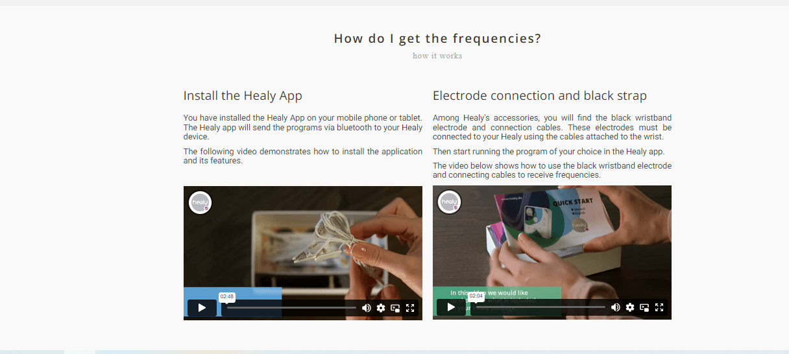
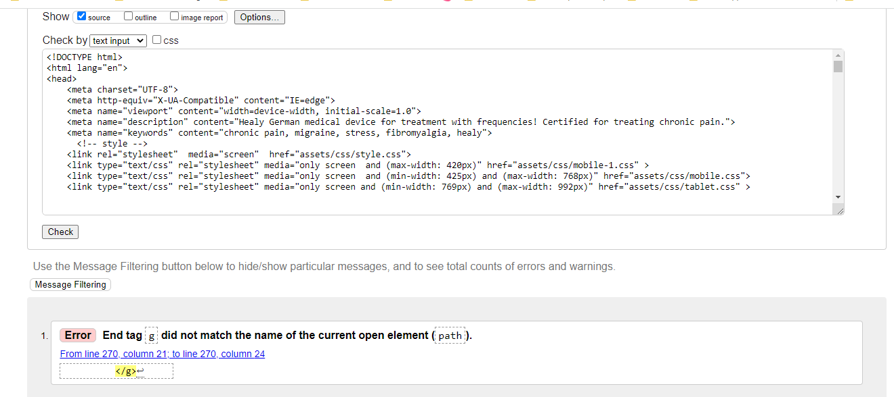
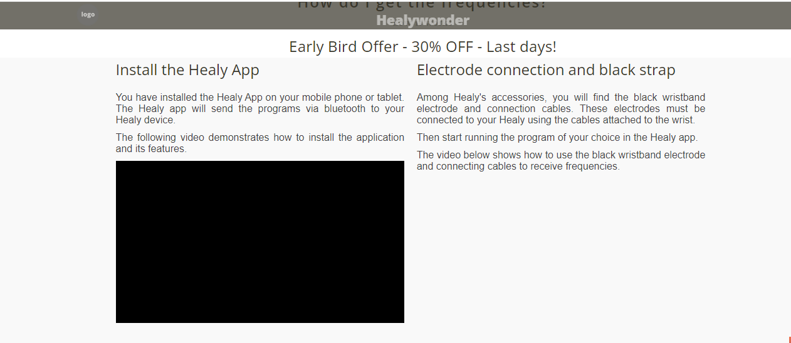

Welcome to [Healywonder](https://cintiamar.github.io/healywonder/index.html)

# Healywonder

## Design Concept
Healy Wonder is a ***Landing Page*** developed to promote _sales offer_ for a frequency therapy in digital marketing campaigns to the ***female audience*** to a German device named **Healy**.

Healy is a device **certified for chronic pain** that uses microcurrent frequency (MIF) programs to increase your health, vitality, and well-being. 

The site's design concept communicates the feeling of well-being of a woman able to enjoy life without chronic pain.

Another important aspect is that While the homepage has dozens of possible distractions, the **landing page** is super **focused**.

### Buyer Persona

The design is developed to interact with the _female buyer persona_, ***classified in the limbic map as "Hedonist and Adventure"***.

The Limbic map was found [here](https://www.widerfunnel.com/wp-content/uploads/2017/10/Limbic%C2%AE-types.png)

Despite being a focused Landing page, a **Quiz** on the subject of frequency therapy is used to provide interaction with the user.

### Colors
The colors orange, purple, pink was chose to refer to the Hedonist and Adventurer limbic profiles defined in the Limbic Map developed by neuromarketing studies.

A light background color refers to tranquility and clarity, contrasting with the predominantly orange details, with details in blue and purple.

### Responsive Web Design
The landing page is designed to be responsive and accesible on a range of devices, making it easy to navigate for potetial customers.

### One Page
As a Landing page, it is designed to be one page site with link to the online shop.
However, an additional "under construction" page has been developed to link to the information contained in the footer:

- Imprint
- Privacy
- Contact

Imprint, Privacy and Contact  were not developed at this stage of the project.   

The contact form, cookie policy, and input for the newsletter are foreseen in the project and will be developed later.

## Hero

This section will allow the user to be immediately visually triggered by the **sales offer** with the **countdown** and **"last days"** message at the top of the landing page.

The **sticky header** accompanies the user through the landing page, with the sales offer and working on the branding of the brand.

The hero contains a message with the ***keyword 'chronic pain'*** to identify the subject of the landing page to the user.

In order to generate interactivity and quick access to information, 2 buttons were developed:
- know-more;
- and buy-now.

### The landing page image and buttons

The homepage includes a photograph of a woman feeling well and free from chronic pain with 3 buttons overlapping in a different design to establish a visual hierarchy.

In addition to the visual hierarchy, these buttons allow the user to quickly access the pages of the site according to the marketing campaign strategy.

The page has 3 buttons in different designs:

1.  **coupon code** : in addition to providing the code to receive the 30% discount on the purchase, it was developed to generate interactivity with the user;

2. **know-more**: links directly to two videos that explain the product of the sales page offer;

3. **buy-now**: call-to-action (CTA) button with a link to the online store. It is given the main color of the theme to make it stand out among the other buttons.

### Coupon Code
    

   
    In order to generate interactivity with users, the coupon code is generated through out a modal pop-up on the click button "coupon code"

## The Structure of Content 

The landing sessions are distributed in 4 different structures according to their content.

1. Information about the product ***in text***: the session starts with an **icon** and below contains information about the product;

2. Information about the product ***in videos***: the session starts in text, without an icon, and below videos with information about the product;

3. Info-box : device medical application information - has greater importance of hierarchy, and receives the same color scheme as the landing page.e.

4. button call-to-action : 2 CTA buttons distributed by the site, buy-now and newsletter.

Both are designed with attractive cores that stand out among the site's content. With minimal text, they invite the user to action.

## Quiz

In order to generate interactivity with the user, and provide more information about the product in a playful way, a quiz was developed just below the videos.
Thus, after the user receives content about the product through videos, he is invited to interact for a longer time with the landing page, test his knowledge and clarify alleged objections.

### Quiz Score

### Quiz Modal Popup

## Footer nd Newsletter

## Page Under Construction

### **imprint - privacy - contact**

To connect the footer´s links, a page under construction was developed.

As mentioned at the beginning, the development of these 3 pages is not part of this stage of the project.

------

## Validator  Report 

###  HTML
All codings were checked at [W3C HTML Validator](https://validator.w3.org/#validate_by_input).

##### Index

Therefore still remained an error: `end tag g dit not match with path`

I didn't find any information that justified the error pointed out in the HTML checker report.
**Please see my comments on Unfixed bugs**

.

### CSS 
CSS stylesheets were checked at [W3C CSS Validator](https://jigsaw.w3.org/css-validator/).

##### Index

##### Mobile

### Performance of  Website

The performance of website pages were checked at Lighthouse Google Chrome tool. 

The report suggested that Vimeo is slowing down the site's performance. 

### Vimeo-free performance simulation

A simulation was performed to see how the site would perform without Vimeo videos.

 It can be seen that the score increases significantly from 70% to 89%.

 ### Lazy Load Test

An alternative to viewing Vimeo videos without compromising the site's performance would be to use **lazy load**.

I tested the alternative suggested by  The Mudra Organization, Tutorial found [here](https://github.com/the-muda-organization/vimeo-lazyload), however, my test did not succeed.

`The video was not displayed`

### Lazy Load files

## Unfixed Bugs

### HTML error

1. `end tag g dit not match with path` - **HTML Validator**

**Note**
In the W3 Schools tutorial on stroke properties, all examples use `g with path`.
I didn't find any information that justified the error pointed out in the HTML checker report.

[SVG Stroke Properties](https://www.w3schools.com/graphics/svg_stroking.asp)

------

## Features

### Languages
- HTML5
 - CSS
 - JavaScript

Frameworks, Libraries & Programs Used

### Features to be developed in this Project:
- contact form development;
- database contact form connection.

## Existing Features

Frameworks, Libraries & Programs Used

1. **JavaScript**
2. **Hover.css**  
Hover.css was used on header h1, sroll-to-top, buttons and the Social Media icons to add float transition while being hovered over.
3. **Google Fonts**: 
Google fonts were used to import the " Roboto" font into the style.css file which is used to all pages throughout the project.
4. **Font Awesome**:
Font  Awesome was  used to all pages throughout the website to add icons for aesthetic and UX proposes.
6. **Git**:
Git was used for version control by utilizing Gitpod terminal to Git and Push to Github.
7. **Github**:
  Github is used to store the projects code after being pushed from Git.
8. **Canva**:
Canva was used to create the layout, logo, resizing images and editing photos for the website.
10. **TinyPng**:
TinyPng was used to reduce file size and thus optimize website performance.
11. **Cloudconvert**:
Cloudconvert was used to convert the shrinked images to webp  format.
12. **Favicon**:
[Real Favicon Generator](https://realfavicongenerator.net/) used to create favicon.

## Credits

1. [Codinglearners](https://www.codinglearners.com/how-to-create-product-sales-countdown-timer-using-html-css-js) - Sales  Countdown Timer: 
 countdown used on the hero to show sales offer left time. 
 

2. [Easy Tutorials ](https://www.youtube.com/watch?v=AF6vGYIyV8M&t=549s) - Coupon Code: Modal Popup used on home page 

3. [Codepen](https://codepen.io/kklumpp13/pen/xVwBKE) -  Quiz: Credits to Krystal Klumpp 

4. [W3 Schools](https://www.w3schools.com/howto/tryit.asp?filename=tryhow_css_modal) - Modal Popup: alert Modal Popup used on Quiz

### Content
 All content was written by the developer.
  Psychological properties  of colours  text in the README.md was found <here>

### Media
The Limbic Map - source: [wiederfunnel](https://www.widerfunnel.com/).

All other images were created by the developer

## Acknowledgments
My `Mentor Jubril` for continuous helpful  feedback.

**November 17, 2022**

